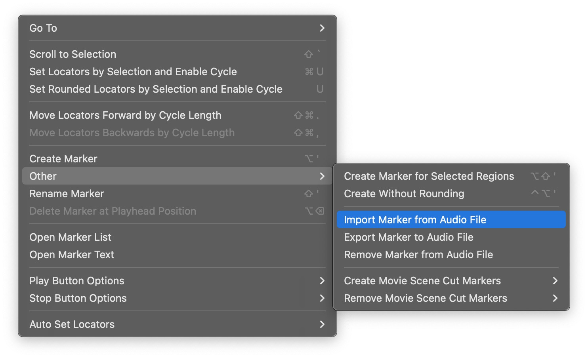

# LogicMarkersAI: Film Scene Analysis and Logic Marker Generation

This project provides tools to analyze a video file, automatically detect scenes, generate descriptive text for each scene using AI (Google Generative AI), and create a silent audio file with embedded markers suitable for import into Digital Audio Workstations (DAWs) like Logic Pro. It is designed to assist with creating timed cues for sound design or music composition.

## Overview

The workflow consists of two main steps:

1.  **Scene Detection and Description:** Analyze a video to identify distinct scenes, extract representative images, use a Vision LLM to describe the content based on the images and provided context, generate concise titles and summaries, and optionally merge similar adjacent scenes.
2.  **Audio Marker Generation:** Convert the generated scene descriptions (specifically start times, titles, and summaries) into markers embedded within a silent WAV audio file.

## Features

*   **Automatic Scene Detection:** Uses `scenedetect` library to find scene cuts in a video.
*   **AI-Powered Scene Description:** Leverages Google's Generative AI (Gemini) to describe scenes based on extracted start, middle, and end frames, informed by custom context (`context.txt`).
*   **Title & Summary Generation:** Automatically creates concise titles and summaries for each scene using the LLM.
*   **Scene Merging:** Optionally compares descriptions of adjacent scenes using the LLM and merges them if deemed similar.
*   **Logic Pro Compatible Markers:** Generates a silent WAV file containing markers that can be directly imported into Logic Pro or other DAWs that support marker import via WAV.
*   **Data Export:** Outputs detailed scene information in JSON (`scenes_data.json`) and a simplified version in CSV (`scenes.csv`). Scene images are saved for review.

## Files

*   `scene_describe.py`: Main script for scene detection, image extraction, AI description/titling/summarization, scene merging, and CSV/JSON output generation.
*   `scene_description_to_audio_markers.py`: Script to convert the `scenes.csv` output into a silent WAV file with embedded markers.
*   `logic_markers.py`: Core library handling the creation and writing of marker data into WAV files according to the Logic Pro format. Defines `Marker` and `LogicMarkerWriter` classes.
*   `markers.csv`: (Potentially unused/legacy) A simple CSV format for markers. The primary workflow uses the CSV generated by `scene_describe.py`.
*   `scene_images/`: Default directory where images extracted from scenes by `scene_describe.py` are stored.

## Workflow

1.  **Set Environment Variable:** Ensure your Google AI API key is available:
  ```shell
  export GOOGLE_API_KEY='YOUR_API_KEY'
  ```
2.  **Run Scene Description:** Execute `scene_describe.py` to process the video.
  ```shell
  python scene_describe.py process \
      --video_path path/to/your/video.mp4 \
      --output_dir scene_output \
      --llm_context context.txt \
      --verbose 
  ```
   This will create the `scene_output` directory (if it doesn't exist) containing `scenes.csv`, `scenes_data.json`, and scene images.
3.  **Generate Audio Markers:** Execute `scene_description_to_audio_markers.py` using the generated CSV.
  ```shell
  python scene_description_to_audio_markers.py convert \
      --csv_input scene_output/scenes.csv \
      --output_audio scene_output/scene_markers.wav \
      --verbose
  ```
   This creates `scene_markers.wav` in the `scene_output` directory.


4.  **Import Markers into Logic Pro:** Open your Logic Pro project, then navigate to `Navigate > Other > Import Marker from Audio File` and select the generated `scene_markers.wav` file. [Source](https://support.apple.com/en-is/guide/logicpro/lgcpadb63ff8/mac)



## Prerequisites

*   Python 3.x
*   Required Python libraries:
    *   `scenedetect` (including OpenCV dependency, e.g., `opencv-python`)
    *   `google-generativeai`
    *   `Pillow`
    *   `fire`
    *   NumPy (often a dependency of OpenCV or scenedetect)
*   `GOOGLE_API_KEY` environment variable set with a valid API key for Google Generative AI.

## Input / Output

*   **Input:**
    *   Video file (e.g., `.mp4`)
    *   `context.txt` file providing guidance for the LLM.
*   **Output (typically in `output_dir`):**
    *   `scenes_data.json`: Detailed scene information including timecodes, frames, descriptions, titles, summaries.
    *   `scenes.csv`: Simplified scene data used for marker generation.
    *   `scene_markers.wav`: Silent WAV file with embedded markers.
    *   Scene images (e.g., `Scene-001-01.jpg`, `Scene-001-02.jpg`, etc.) within the output directory.

## TODO

*   Refactor the project into a proper Python package structure.
*   Expose the core functionalities of `scene_describe.py`, `scene_description_to_audio_markers.py`, and potentially `logic_markers.py` as installable command-line tools.
*   Add formal dependency management using `requirements.txt` and potentially `conda.yml`.
*   Abstract the Language Model (LLM) interaction layer to allow easier integration of different providers (e.g., local models, OpenAI, Anthropic) besides Google Generative AI. 